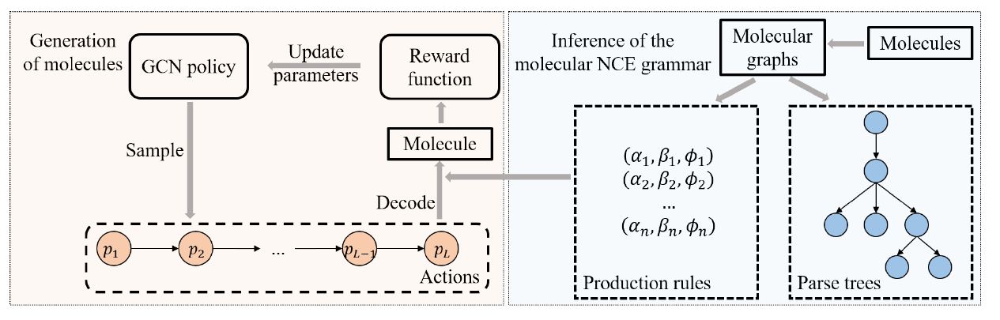

# Reinforced Molecular Optimization with Neighborhood-Controlled Grammar

## Requirements

Anaconda is recommended to run the project.
~~~
conda create -n MNCERL python=3.6 
source activate MNCERL
~~~

Install rdkit:
~~~
conda install -c conda-forge rdkit
~~~

Install related packages:
~~~
pip install -r requirement.txt
cd MyLib
python setup.py install
~~~
Prepare data:
~~~
cd Data
ls *.tar.gz|while read line
do
tar -xzvf ${line}
done
~~~

## Training and evaluations

We have provided the trained models, including the pre-train model, under tasks. You can train your own model by:
~~~
python main.py -c PATH_TO_CONFIG
~~~
Please refer to *config_example.py* for the format of the config file. Under tasks, we have provided the *config.py* and results for the statistics presented in our paper.
