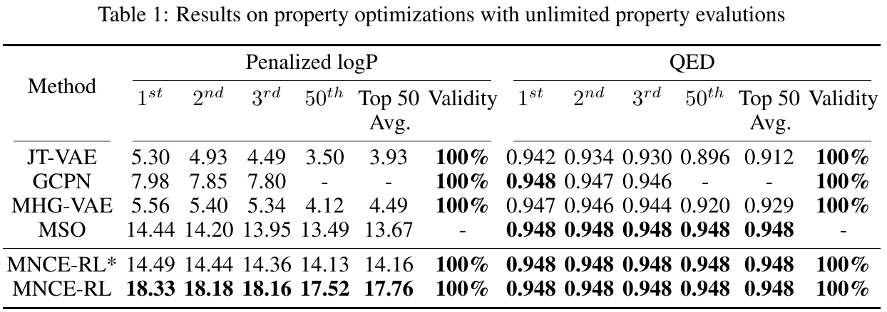
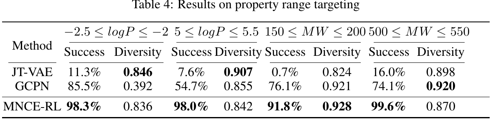

# Reinforced Molecular Optimization with Neighborhood-Controlled Grammar

## Requirements

Anaconda is recommended to run the project.
~~~
conda create -n MNCERL python=3.6 
source activate MNCERL
~~~

Install rdkit:
~~~
conda install -c conda-forge rdkit
~~~

Install related packages:
~~~
pip install -r requirement.txt
cd MyLib
python setup.py install
~~~
Prepare data:
~~~
cd Data
ls *.tar.gz|while read line
do
tar -xzvf ${line}
done
~~~

## Training

We have provided the trained models, including the pre-train model, under Data/log/train_log. To train the models, please refer to the run.sh under each task directory.  

## Evaluation

The models can be evaluated by:
~~~
cd TaskDir
python main.py -t 0
~~~

## Results
The sampled molecules for each task have been provided under each directory.

### Property optimization with unlimited property evaluation queries
To reproduce the results of optimizing penalized logP and optimizing QED scores, run
~~~
# reproduce the results of optimizing penalized logP
cd Optimize_logp 
python main.py -t 0

# reproduce the results of optimizing QED
cd Optimize_qed
python main.py -t 0
~~~

### Property range targeting

~~~
# reproduce targeting -2.5<= penalized logP <=-2.0
cd Target_225_Logp
python main.py -t 0

# reproduce targeting 5.0<=penalized logP <=5.5
cd Target_525_Logp
python main.py -t 0

# reproduce targeting 150<= MW <= 200
cd Target_175_MW
python main.py -t 0

# reproduce targeting 500<= MW <= 550
cd Target_525_MW 
python main.py -t 0
~~~

### Constrained property optimization

~~~
cd Constraint_Opt
bash run.sh        #this may take a long time
~~~

### Property optimization with limited property evaluation queries

~~~
cd Optimize_logp_limited_o
bash run.sh
python merge.py
~~~

### Antibiotic discovery

~~~
cd Antibiotic
python main.py -t 0
~~~

