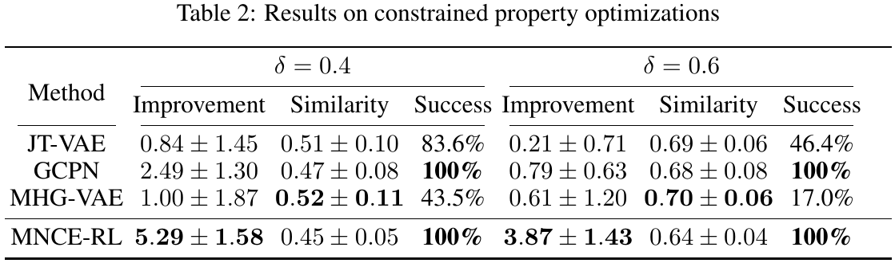
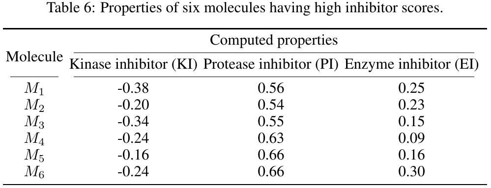

# Reinforced Molecular Optimization with Neighborhood-Controlled Grammar

## Requirements

Anaconda is recommended to run the project.
~~~
conda create -n MNCERL python=3.6 
source activate MNCERL
~~~

Install rdkit:
~~~
conda install -c conda-forge rdkit
~~~

Install related packages:
~~~
pip install -r requirement.txt
cd MyLib
python setup.py install
~~~
Prepare data:
~~~
cd Data
ls *.tar.gz|while read line
do
tar -xzvf ${line}
done
~~~

## Training
| \\multirow\{3\}\{\*\}\{Method\} | \\multicolumn\{6\}\{c\}\{Penalized logP\} | \\multicolumn\{6\}\{c\}\{QED\} |
|---------------------------------|-------------------------------------------|--------------------------------|
|                                 | $1^\{st\}$                                | $2^\{nd\}$                     | $3^\{rd\}$     | $50^\{th\}$    | \\vtop\{\\hbox\{\\strut Top 50\}\\hbox\{\\strut\\ \\ Avg\.\}\} | Validity        | $1^\{st\}$     | $2^\{nd\}$     | $3^\{rd\}$     | $50^\{th\}$     | \\vtop\{\\hbox\{\\strut Top 50\}\\hbox\{\\strut\\ \\ Avg\.\}\} | Validity        |
| %ZINC                           | 4\.52                                     | 4\.30                          | 4\.23          | 3\.73          | 3\.88                                                          | 100\\%          | 0\.948         | 0\.948         | 0\.948         | 0\.947          | 0\.948                                                         | 100\\%          |
| JT\-VAE                         | 5\.30                                     | 4\.93                          | 4\.49          | 3\.50          | 3\.93                                                          | \{\\bf 100\\%\} | 0\.942         | 0\.934         | 0\.930         | 0\.896          | 0\.912                                                         | \{\\bf 100\\%\} |
| GCPN                            | 7\.98                                     | 7\.85                          | 7\.80          | \-             | \-                                                             | \{\\bf 100\\%\} | \{\\bf0\.948\} | 0\.947         | 0\.946         | \-              | \-                                                             | \{\\bf 100\\%\} |
| MHG\-VAE                        | 5\.56                                     | 5\.40                          | 5\.34          | 4\.12          | 4\.49                                                          | \{\\bf 100\\%\} | 0\.947         | 0\.946         | 0\.944         | 0\.920          | 0\.929                                                         | \{\\bf 100\\%\} |
| MSO                             | 14\.44                                    | 14\.20                         | 13\.95         | 13\.49         | 13\.67                                                         | \-              | \{\\bf0\.948\} | \{\\bf0\.948\} | \{\\bf0\.948\} | \{\\bf0\.948\}  | \{\\bf0\.948\}                                                 | \-              |
| MNCE\-RL\*                      | \{14\.49\}                                | \{14\.44\}                     | \{14\.36\}     | \{14\.13\}     | \{14\.16\}                                                     | \{\\bf100\\%\}  | \{\\bf0\.948\} | \{\\bf0\.948\} | \{\\bf0\.948\} | \{\\bf 0\.948\} | \{\\bf 0\.948\}                                                | \{\\bf 100\\%\} |
| MNCE\-RL                        | \{\\bf18\.33\}                            | \{\\bf18\.18\}                 | \{\\bf18\.16\} | \{\\bf17\.52\} | \{\\bf17\.76\}                                                 | \{\\bf 100\\%\} | \{\\bf0\.948\} | \{\\bf0\.948\} | \{\\bf0\.948\} | \{\\bf 0\.948\} | \{\\bf 0\.948\}                                                | \{\\bf 100\\%\} |

We have provided the trained models, including the pre-train model, under Data/log/train_log. To train the models, please refer to the run.sh under each task directory.  

## Evaluation

The models can be evaluated by:
~~~
cd TaskDir
python main.py -t 0
~~~

## Results
The sampled molecules for each task have been provided under each directory.

### Property optimization with unlimited property evaluation queries
To reproduce the results of optimizing penalized logP and optimizing QED scores, run
~~~
# reproduce the results of optimizing penalized logP
cd Optimize_logp 
python main.py -t 0

# reproduce the results of optimizing QED
cd Optimize_qed
python main.py -t 0
~~~

### Property range targeting

~~~
# reproduce targeting -2.5<= penalized logP <=-2.0
cd Target_225_Logp
python main.py -t 0

# reproduce targeting 5.0<=penalized logP <=5.5
cd Target_525_Logp
python main.py -t 0

# reproduce targeting 150<= MW <= 200
cd Target_175_MW
python main.py -t 0

# reproduce targeting 500<= MW <= 550
cd Target_525_MW 
python main.py -t 0
~~~

### Constrained property optimization

~~~
cd Constraint_Opt
bash run.sh        #this may take a long time
~~~

### Property optimization with limited property evaluation queries

~~~
cd Optimize_logp_limited_o
bash run.sh
python merge.py
~~~

### Antibiotic discovery

~~~
cd Antibiotic
python main.py -t 0
~~~

